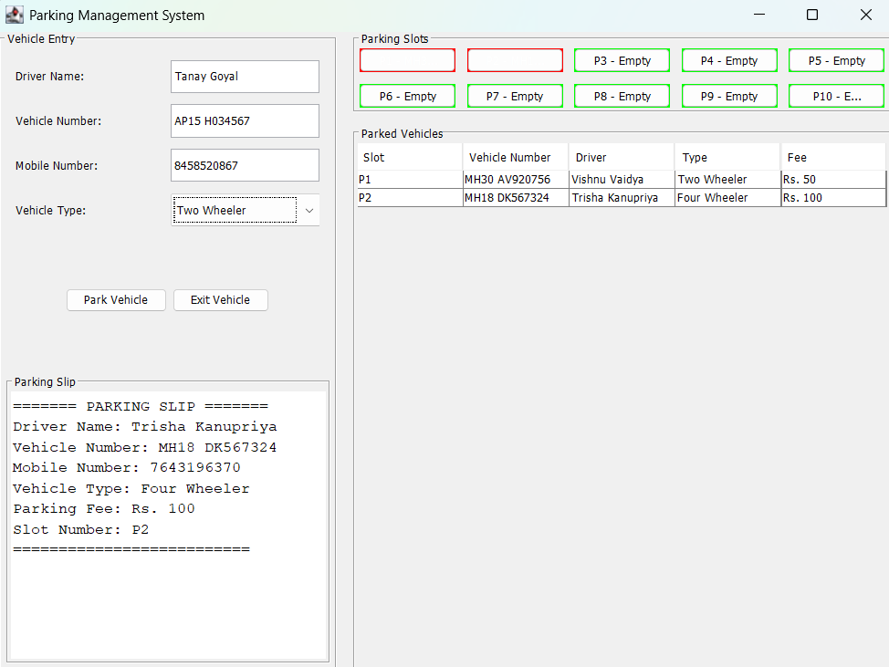

PARKING MANAGEMENT SYSTEM

A user-friendly, GUI-based Parking Management System built in Java. This project allows users to manage parking operations like adding, removing, and viewing vehicles through an intuitive Swing interface.

FEATURES:
-Add new vehicles (Cars, Motorcycles, etc.)
-Remove vehicles from the parking lot
-View all currently parked vehicles
-Graphical User Interface (GUI) using Java Swing
-Efficient backend logic for handling parking operations

PROJECT STRUCTURE:
-ParkingSystem.java // Main entry point
-ParkingSystemUI.java // Swing GUI for interacting with users
-ParkingManager.java // Business logic for parking operations
-Vehicle.java // Data model representing a vehicle
-*.class // Compiled class files (auto-generated)

CLASS OVERVIEW:
Vehicle.java
Represents a vehicle with basic attributes:
-Vehicle type (e.g., Car, Motorcycle)
-License plate number
-Entry time

ParkingManager.java
Handles the core logic for:
-Adding and removing vehicles
-Keeping track of the parked vehicles
-Ensuring duplicate entries aren't allowed

ParkingSystemUI.java
Implements the GUI using Java Swing:
-Buttons to add and remove vehicles
-Table to display current vehicles
-Simple layout and clear interface

ParkingSystem.java
Acts as the launcher class:
-Instantiates and displays the GUI

GETTING STARTED
Prerequisites:
Java JDK 8 or higher
Command line or Java IDE (like IntelliJ IDEA or Eclipse)
How to Compile:
javac *.java

How to Run:
java ParkingSystem

SCREENSHOTS

(screenshots of the GUI once the program is running.)

POSSIBLE IMPROVEMENTS
Add user authentication (Admin access)
Store parking data in files or a database
Implement search functionality
Generate reports (total vehicles, parking duration, etc.)
Enhance GUI with more modern design
